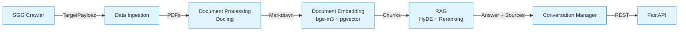

# Legal AI — Sovereign RAG for legal documents

[](LICENSE)
[](https://www.python.org/downloads/)
[](tests/)
[](https://huggingface.co/spaces/moadennagi/legal-ai)

> **Sovereign Retrieval-Augmented Generation pipeline for French legal documents**, built on open-source models and deployable on-premise. Validated on the Moroccan Official Gazette (*Bulletin Officiel*).

---

## 🎯 Why this project?

Legal institutions face a tension: large language models offer powerful information retrieval, but cloud-hosted LLMs require sending sensitive documents to third-party infrastructure — incompatible with regulatory or confidentiality constraints. This project demonstrates that a **fully self-hosted RAG pipeline**, built on open-source components and deployed on commodity hardware, can deliver competitive quality on a normative legal corpus.

The system was developed and evaluated on the public *Bulletin Officiel du Royaume du Maroc* as a substitute corpus for an institutional use case. The architecture is designed to transpose to any French-language legal corpus with minimal adaptation.

---

## ✨ Features

- **Automated ingestion** — crawler for `sgg.gov.ma`, concurrent PDF download with rate limiting
- **Structure-aware segmentation** — preserves legal hierarchy (*Dahir → Loi → Chapitre → Article*) via a custom Markdown splitter
- **Dense retrieval** — multilingual `bge-m3` embeddings stored in PostgreSQL + pgvector
- **HyDE** — Hypothetical Document Embeddings for cross-register query/document gap (Gao et al., 2022)
- **Cross-encoder reranking** — `ms-marco-MiniLM-L-6-v2` (Nogueira & Cho, 2019)
- **Conversation management** — sliding-window history with automatic compression
- **OpenAI-compatible API** — drop-in `POST /v1/chat/completions` endpoint
- **RAGAS evaluation** — 4 metrics (faithfulness, answer relevancy, context precision, context recall)
- **Cloud-ready** — supports both local Ollama and OpenAI-compatible providers (Together AI, Groq)

---

## 🏗️ Architecture



Five decoupled phases communicate exclusively through a central PostgreSQL database. Each phase can be re-run, swapped, or scaled independently.

| Phase | Module | Responsibility |
|---|---|---|
| 1 — Ingestion | `pipeline/ingestion.py` | Crawl, download PDFs, store metadata |
| 2 — Processing | `pipeline/processing.py` | PDF → Markdown via Docling |
| 3 — Embedding | `pipeline/embedding.py` | Chunking + vector indexing |
| 4 — RAG | `pipeline/rag.py` | HyDE + dense retrieval + reranking |
| 5 — Conversation | `pipeline/conversation.py` | Multi-turn dialogue management |

The thesis manuscript (chapter 3) covers the design rationale and trade-offs in detail.

---

## 🚀 Online demo

👉 **[huggingface.co/spaces/moadennagi/legal-ai](https://huggingface.co/spaces/moadennagi/legal-ai)**

The demo lets you query a curated subset of the corpus with the configuration recommended in our evaluation: `bge-m3` embedding + cross-encoder reranking + `mistral:7b` generation via Together AI.

It is packaged as a single Docker container (Postgres + pgvector + Ollama + FastAPI + Streamlit) — see [`Dockerfile.hfspace`](Dockerfile.hfspace) and [`README_HFSPACE.md`](README_HFSPACE.md) for the deployment details.

---

## 📦 Installation

### Option 1 — Docker Compose (recommended)

```bash
git clone https://github.com/moadennagi/legal-ai.git
cd legal-ai
cp env.example .env
# Edit .env: set DB_PASSWORD and (optionally) TOGETHER_API_KEY
docker-compose up -d

# Apply database migrations
docker-compose exec postgres psql -U postgres -d legal_ai -f /docker-entrypoint-initdb.d/init.sql

# API ready at http://localhost:8000
curl http://localhost:8000/health
```

### Option 2 — Local development

**Prerequisites**: Python 3.12+, [uv](https://docs.astral.sh/uv/), PostgreSQL 16+ with [pgvector](https://github.com/pgvector/pgvector), [Ollama](https://ollama.com/) (for local LLMs).

```bash
# 1. Install dependencies
uv pip install -e ".[dev]"

# 2. Configure environment
cp env.example .env
# Edit .env with your local settings

# 3. Initialize database
psql -U postgres -d legal_ai -f sql/init.sql
for f in sql/*_*.sql; do psql -U postgres -d legal_ai -f "$f"; done

# 4. Pull Ollama models
ollama pull bge-m3
ollama pull qwen2.5:7b

# 5. Run the API
uvicorn legal_ai.api.main:app --reload
```

### Option 3 — Cloud-only (Together AI, no local LLM)

Skip the Ollama installation and set `LLM_PROVIDER=together` in `.env`. The pipeline routes embedding and generation to Together AI's OpenAI-compatible endpoints.

---

## 🔌 API usage

The API is OpenAI-compatible. Use any OpenAI client:

```python
from openai import OpenAI

client = OpenAI(base_url="http://localhost:8000/v1", api_key="not-needed")
response = client.chat.completions.create(
    model="legal-ai",
    messages=[
        {"role": "user", "content": "Quelles sont les conditions d'octroi d'une aide à l'agriculture ?"}
    ]
)
print(response.choices[0].message.content)
```

Endpoints:
- `GET /health` — liveness probe
- `GET /v1/models` — list available models
- `POST /v1/chat/completions` — chat completion (rate-limited to 10 req/min/IP)

Full OpenAPI schema at `http://localhost:8000/docs`.

---

## 🧪 Development

```bash
# Tests
pytest                      # all tests
pytest --cov                # with coverage
pytest tests/test_rag.py    # single file

# Linting
ruff check                  # style
ruff check --fix            # auto-fix
mypy src/                   # type-check
```

---

## 📊 Evaluation

The system is evaluated using [RAGAS](https://github.com/explodinggradients/ragas) on 79 hand-validated question-answer pairs covering three legal domains (social law, tax law, corporate law). Key findings:

| Configuration | Score moyen | Best metric |
|---|---|---|
| Baseline (no HyDE, no reranking) | 0.776 | rappel contexte 0.81 |
| **+ Reranking only** | **0.782** | **précision contexte 0.86** |
| + HyDE only | 0.731 | — |
| + HyDE + Reranking | 0.778 | fidélité 0.74 |

**Counter-intuitive finding**: HyDE *degrades* context precision on normative legal text because generalist 7B models paraphrase in everyday French rather than reproducing the formal legal register. See [docs/EVALUATION.md](docs/EVALUATION.md) for the full methodology.

---

## 📁 Repository layout

```
legal-ai/
├── src/legal_ai/                     # Main package
│   ├── adapters.py                   # Ollama / OpenAI-compatible LLM adapters
│   ├── api/                          # FastAPI server (OpenAI-compatible)
│   ├── crawlers/                     # SGG crawler
│   ├── evaluation/                   # RAGAS evaluation framework
│   ├── interfaces.py                 # Abstract interfaces (DI boundaries)
│   ├── models/                       # SQLAlchemy + Pydantic schemas
│   ├── pipeline/                     # Ingestion, processing, embedding, RAG, conversation
│   ├── repositories/                 # Data access layer
│   ├── settings.py                   # Pydantic settings (env-driven)
│   └── splitters/                    # Document segmentation strategies
├── tests/                            # Pytest suite (62 tests)
├── sql/                              # Database schema and migrations
├── data/                             # Raw PDFs corpus (gitignored — ~13 GB)
├── evals/                            # ✅ Published evaluation artefacts
│   ├── README.md                     # Documentation of the eval data
│   ├── ragas_eval_dataset.csv        # 79 hand-validated Q/A pairs
│   ├── figures/                      # Charts (PNG)
│   ├── results/                      # Per-configuration RAGAS scores (CSV)
│   └── summary.json                  # Aggregated mean scores per config
├── frontend/                         # Streamlit demo (Hugging Face Spaces)
├── docs/                             # Public documentation
├── .github/workflows/                # CI/CD (lint, test, Docker build)
├── Dockerfile                        # Multi-stage build for the API
├── docker-compose.yml                # API + Postgres+pgvector
└── README.md                         # This file
```

## 📚 Documentation

- [docs/EVALUATION.md](docs/EVALUATION.md) — RAGAS methodology, full results, ablation analysis
- [evals/README.md](evals/README.md) — evaluation dataset documentation
- [README_HFSPACE.md](README_HFSPACE.md) — deployment to HuggingFace Spaces

---

## 🛠️ Tech stack

- **Python 3.12+** with [uv](https://docs.astral.sh/uv/)
- **FastAPI** for the API layer
- **SQLAlchemy 2.x** + **PostgreSQL 16** + **pgvector** for storage and vector search
- **Ollama** for local model serving (optional cloud fallback via Together AI / Groq)
- **Docling** for PDF → Markdown conversion
- **LangChain** text splitters (Markdown header + recursive character)
- **Transformers** (HuggingFace) for cross-encoder reranking
- **RAGAS** for retrieval and generation quality evaluation
- **Streamlit** for the public demo UI

---

## 🙏 Acknowledgements

This implementation builds on the following foundational works:

- Lewis et al. (2020) — *Retrieval-Augmented Generation for Knowledge-Intensive NLP Tasks*
- Reimers & Gurevych (2019) — *Sentence-BERT: Sentence Embeddings using Siamese BERT-Networks*
- Gao et al. (2022) — *Precise Zero-Shot Dense Retrieval without Relevance Labels* (HyDE)
- Nogueira & Cho (2019) — *Passage Re-ranking with BERT*
- Es et al. (2023) — *RAGAS: Automated Evaluation of Retrieval Augmented Generation*

---

## 📄 License

[MIT](LICENSE) © 2026 Moad Ennagi

---

## ⚠️ Disclaimer

This is an academic research project. Outputs may contain inaccuracies and **do not constitute legal advice**. Always verify generated answers against the cited official sources.
